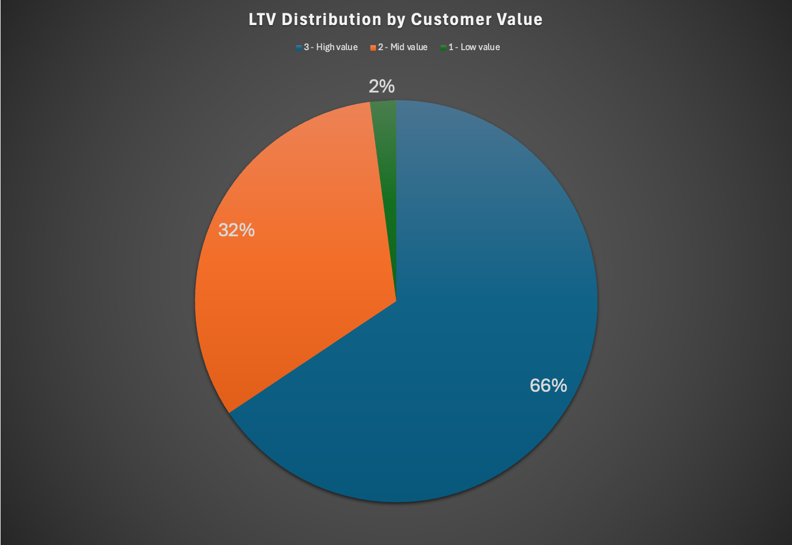
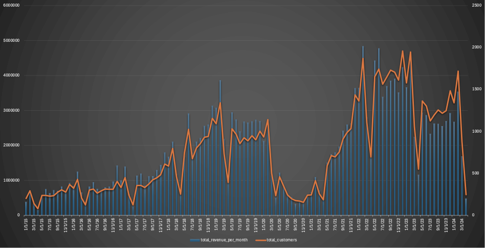
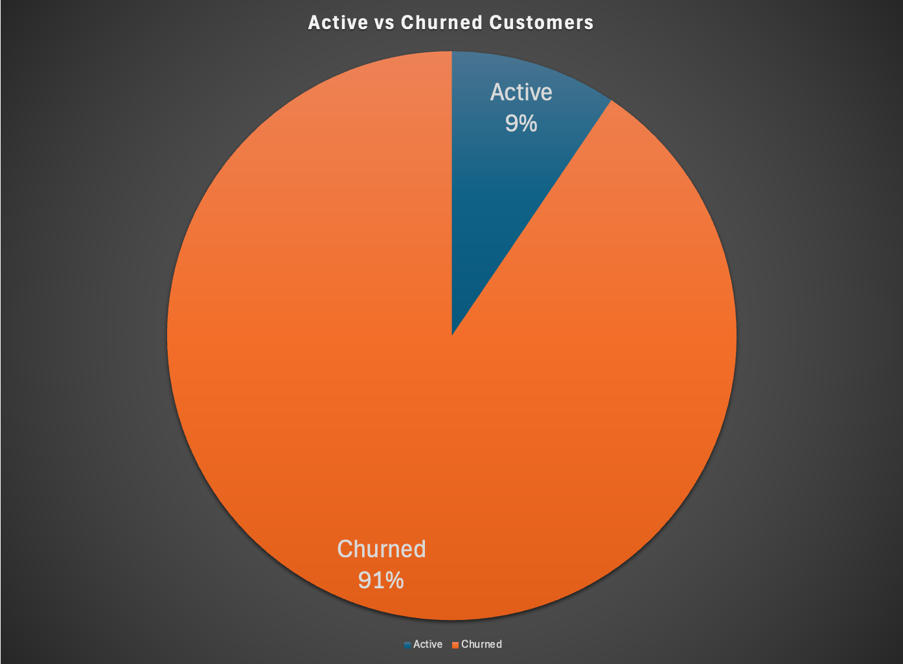

# Intermediate SQL Sales Analysis

## 1. Customer segmentation
[1_customer_segmentation.sql](/1_customer_segmentation.sql)
### Code:
```sql
WITH customer_ltv AS (
	SELECT
		customerkey,
		cleaned_name,
		SUM(total_net_revenue) AS total_ltv
	FROM cohort_analysis
	GROUP BY 
		customerkey, 
		cleaned_name
), percentiles AS (
		SELECT 
			PERCENTILE_CONT(0.25) WITHIN GROUP (ORDER BY total_ltv) AS perc_25,
			PERCENTILE_CONT(0.75) WITHIN GROUP (ORDER BY total_ltv)	AS perc_75
		FROM customer_ltv
), customer_segment AS (
	SELECT
	customer_ltv.*,
	CASE 
		WHEN total_ltv < perc_25 THEN '1 - Low value'
		WHEN total_ltv >= perc_75 THEN '3 - High value'
		ELSE '2 - Mid value'
	END AS customer_value
FROM 
	customer_ltv, 
	percentiles
ORDER BY customerkey
)
	
SELECT 
	customer_value,
	SUM(total_ltv) AS total_ltv,
	SUM(total_ltv) / (SELECT SUM(total_ltv) FROM customer_segment) AS ltv_percentage,
	COUNT(customerkey) AS customer_count,
	SUM(total_ltv) / COUNT(customerkey) AS average_ltv
FROM customer_segment
GROUP BY customer_value
ORDER BY total_ltv DESC;
```
### Graph:



## 2. Cohort Analysis
[2_cohort_analysis.sql](/2_cohort_analysis.sql)
### Code:
```sql
SELECT DISTINCT
	cohort_year,
	SUM(total_net_revenue) AS total_revenue,
	COUNT(DISTINCT customerkey) AS total_customers,
	SUM(total_net_revenue) / COUNT(DISTINCT customerkey) AS customer_revenue	
FROM cohort_analysis
WHERE orderdate = first_purchase_date 
GROUP BY cohort_year;
```
### Graph:


## 3. Customer Retention
[3_retention_analysis.sql](/3_retention_analysis.sql)
### Code:
```sql
WITH cte1 AS (
	SELECT DISTINCT
		s.customerkey, 
		CONCAT(TRIM(givenname), ' ', TRIM(surname)) AS cleaned_name,
		MIN(orderdate) OVER(PARTITION BY s.customerkey) AS first_purchase_date,
		MAX(orderdate) OVER(PARTITION BY s.customerkey) AS last_purchase_date,
		CASE 
			WHEN MAX(orderdate) OVER(PARTITION BY s.customerkey) >= (SELECT MAX(orderdate) FROM sales) - INTERVAL '6 MONTH' THEN 'Active'
			ELSE 'Churned'
		END AS customer_status	
	FROM sales s
	LEFT JOIN customer c ON c.customerkey = s.customerkey
)

SELECT 
	c.customerkey,
	c.cleaned_name,
	c.last_purchase_date,
	c.customer_status 
FROM cte1 c
WHERE first_purchase_date < (SELECT MAX(orderdate) FROM sales) - INTERVAL '6 MONTH';


WITH purchase_date AS (
	SELECT 
		s.customerkey,
		MIN(orderdate) AS first_purchase_date,
		MAX(orderdate) AS last_purchase_date	
	FROM sales s
	GROUP BY s.customerkey
)
SELECT 
	p.customerkey,
	CONCAT(TRIM(givenname), ' ', TRIM(surname)) AS cleaned_name,
	p.last_purchase_date,
	CASE 
		WHEN last_purchase_date >= (SELECT MAX(orderdate) FROM sales) - INTERVAL '6 MONTH' THEN 'Active'
		ELSE 'Churned'
	END AS customer_status	
FROM purchase_date p
LEFT JOIN customer c ON c.customerkey = p.customerkey
WHERE p.first_purchase_date < (SELECT MAX(orderdate) FROM sales) - INTERVAL '6 MONTH';

WITH cte2 AS (
	SELECT 
		customerkey,
		MAX(cleaned_name) AS cleaned_name,
		MAX(orderdate) AS last_purchase_date,
		MAX(cohort_year) AS cohort_year,
		CASE 
			WHEN MAX(orderdate) >= (SELECT MAX(orderdate) FROM sales) - INTERVAL '6 MONTH' THEN 'Active'
			ELSE 'Churned'
		END AS customer_status
	FROM cohort_analysis
	WHERE first_purchase_date < (SELECT MAX(orderdate) FROM sales) - INTERVAL '6 MONTH'
	GROUP BY customerkey
)
SELECT 
	cohort_year,
	COUNT(CASE WHEN customer_status = 'Active' THEN  cte2.customerkey END) AS active_customers,
	COUNT(CASE WHEN customer_status = 'Churned' THEN cte2.customerkey END) AS churned_customers,
	COUNT(customerkey) AS total_customers_per_cohort,
	SUM(COUNT(customerkey)) OVER () AS total_customers
FROM cte2 
GROUP BY cohort_year;
```	
### Graph:

	


